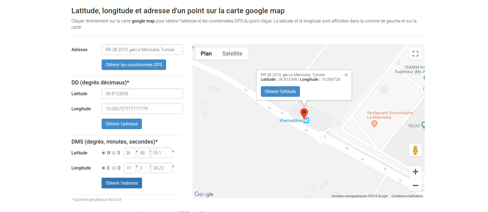

#Chall4 - Forensics
 
### Golden 800 Pts

###### Files :
* Golden.iso

###### Hint :
Find the gold!!

---


1) This appears to be a damaged disk as well, but this challenge is very tricky as it seems that testdisk isn't enough to recover its content...

2) We'll start by using the recovery tool 'testdisk' , we'll come across a lot of files all talking about the movie 'Baby's day out'

3) After searching through all of them.. Nothing! 
The hardest part of this challenge is to think outside the box.. and not to limit yourself to testdisk.... Using [photorec](https://www.cgsecurity.org/wiki/PhotoRec) might help you capture the flag!


4) Using photorec, you'll be able to recover a few files that were deleted and not saved in the system file index !
Keeping in mind the hint ' Find the gold ', you'll find a picture of 'A Golden Book' !

5) Study its meta-data using exiftool to find 
_GPS Position_: 36 deg 48' 55.10", 10 deg 3' 24.22"
```
$ exiftool f0008504.jpg
ExifTool Version Number         : 9.46
File Name                       : f0008504.jpg
Directory                       : .
File Size                       : 27 kB
File Modification Date/Time     : 2018:09:30 01:36:15+01:00
File Access Date/Time           : 2018:09:30 01:36:46+01:00
File Inode Change Date/Time     : 2018:09:30 01:36:15+01:00
File Permissions                : rw-r--r--
File Type                       : JPEG
MIME Type                       : image/jpeg
JFIF Version                    : 1.01
Exif Byte Order                 : Big-endian (Motorola, MM)
X Resolution                    : 300
Y Resolution                    : 300
Resolution Unit                 : inches
Y Cb Cr Positioning             : Centered
GPS Version ID                  : 2.3.0.0
GPS Latitude                    : 36 deg 48' 55.10"
GPS Longitude                   : 10 deg 3' 24.22"
Comment                         : Copyright (C) 1998-2015 Ruby Lane (R)
Image Width                     : 621
Image Height                    : 382
Encoding Process                : Baseline DCT, Huffman coding
Bits Per Sample                 : 8
Color Components                : 3
Y Cb Cr Sub Sampling            : YCbCr4:2:0 (2 2)
Image Size                      : 621x382
GPS Position                    : 36 deg 48' 55.10", 10 deg 3' 24.22"
```


6) Simply use http://www.coordonnees-gps.fr/ to find that location 



7) Using the zoom, you'll understand that it points to 'Station de Métro Terminus kheireddine' 

8) Congrats! Here you go !  The flag is ===>


<blockquote>
kheireddine
</blockquote>
